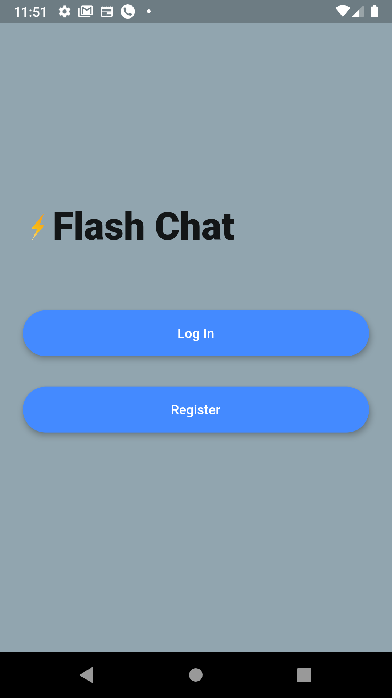
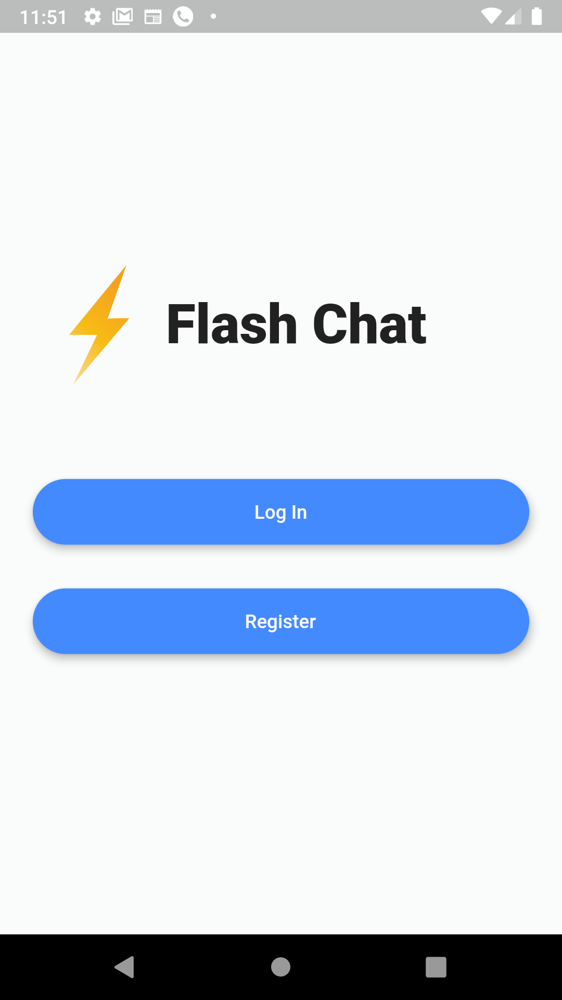
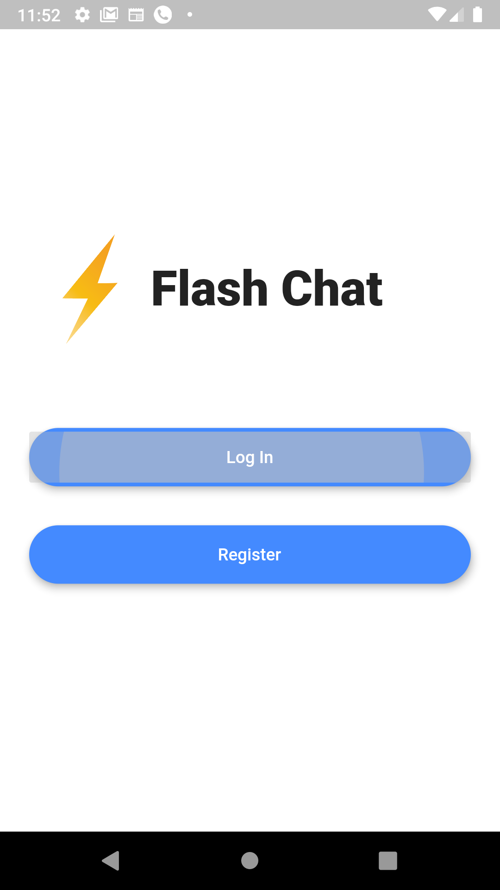
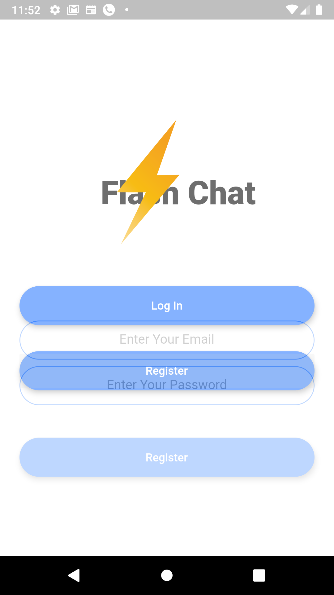
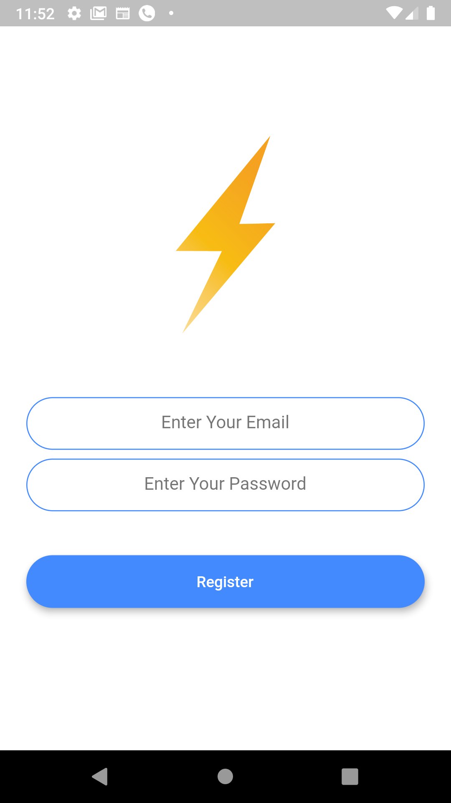
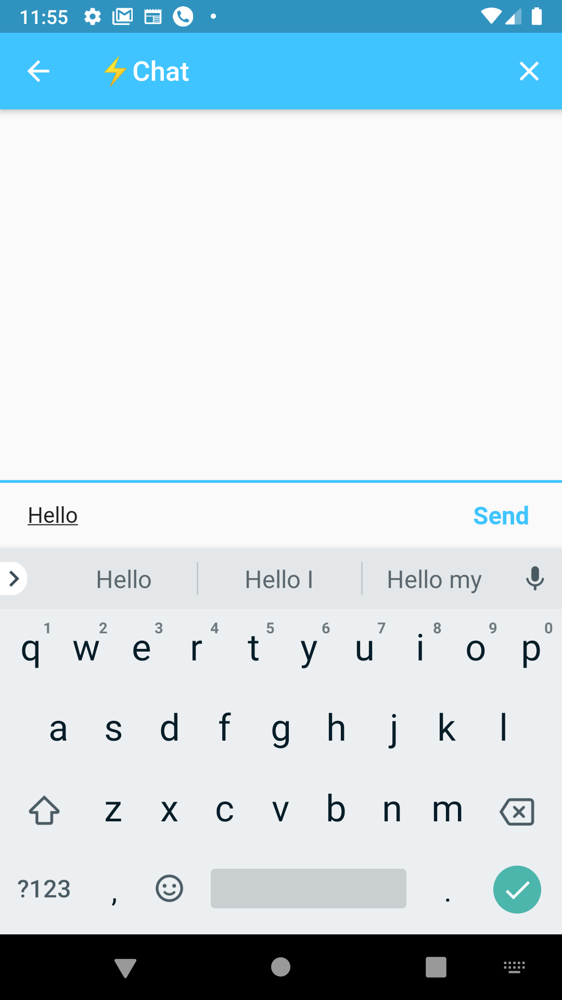
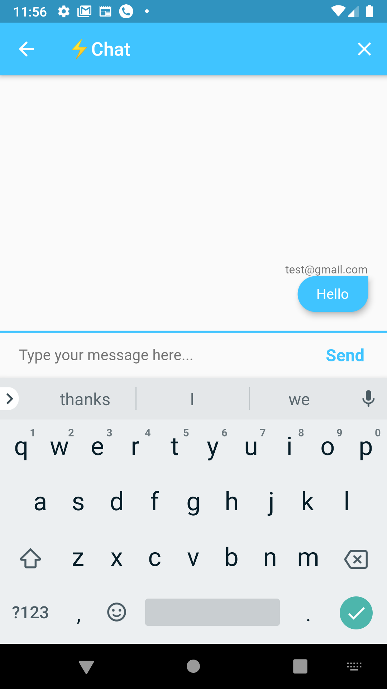
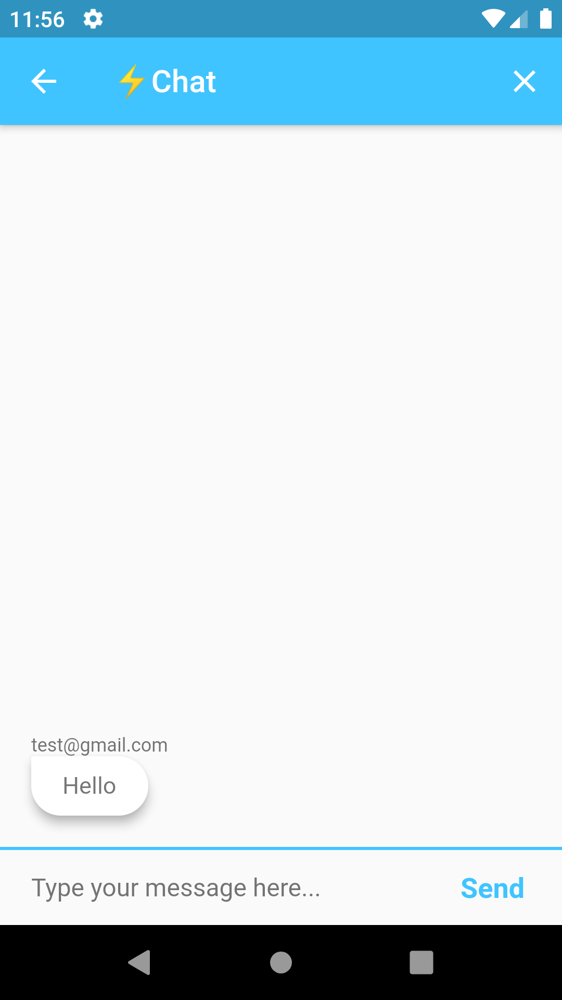
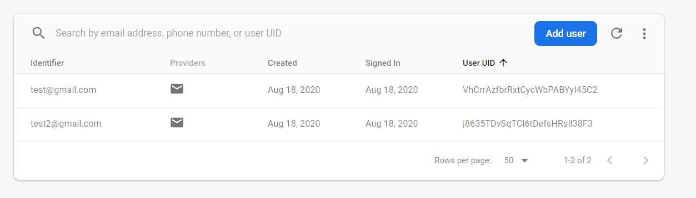
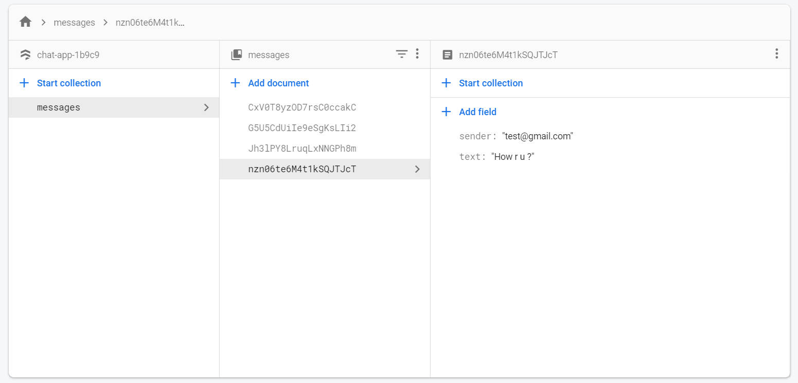

# Chat App

This is a Chat App 

# Tools
- Firebase (Cloud Firestore)
- Cloud Firestore Package
- Firebase Auth Package
- Firebase Core Package
- Animated Text Kit Package
- Modal Progress Hud Package

# Features
- Connecting With Database
- Registering Users with Firebase using FirebaseAuth
- Authenticating Users with FirebaseAuth
- Saving Data into Cloud Firestore
- Listening for Data from Firebase using StreamBuilder
- Managing Data And The Animated UI Efficiently

# Screenshots 
There are Some Screenshots to Show How My App Look. Open Screenshots Folder To See Pictures

